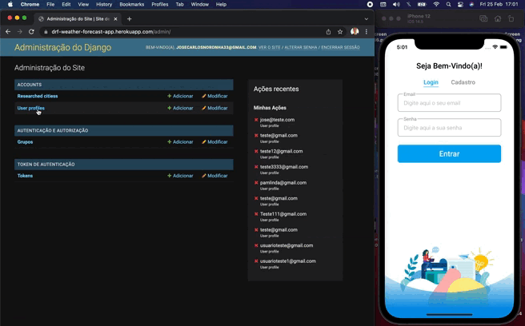

<h1 align="center">
  Weather Forecast App
</h1>
<h3 align="center">
  Projeto fullstack com função de pesquisar e fornecer em tempo real dados sobre previsão do tempo e cadastrar no backend todas as cidades pesquisadas de cada usuário.
</h3>
<h3 align="center">
  Backend do projeto -> https://github.com/JoseCarlos33/Django-Profile-Manager-API
</h3>
<p align="center">
  
</p>

## Instalação das dependencias:
**Para instalar as bibliotecas utilizadas neste projeto basta utilizar o comando:** 

```sh
   yarn
```
## Configurações - Variáveis de ambiente:
**Vá ao arquivo .env e preencha as seguintes variáveis:**

**API_WEATHER_FORECAST_KEY -> Nessa variável deve ser incluida a sua chave da API da Open Weather Map** 
**API_GOOGLE_PLACES_KEY -> Nessa variável deve ser incluida a sua chave da API do Google Places** 

**Após essas configurações basta rodar e instalar o aplicativo e está tudo pronto para utiliza-lo!**

## Para este projeto foi utilizado:

* [ ] React Native
* [ ] Typescript
* [ ] Open Weather Map API
* [ ] Google Places API

## Autor

**José Carlos Noronha**